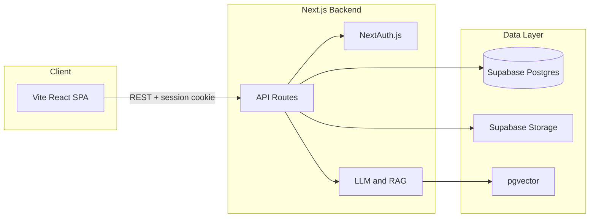

# AI Study Companion for UNITEN — Full Project Implementation Plan

This plan is derived from the [SRS](SRS%20Software%20Requirements%20Specification%20(1).pdf), [Milestone 1 Report](Milestone%201%20Report%20Document%20-%20Final%20Doc%20(1).pdf), and your existing [pixel-perfect-frontend](src/) codebase. It keeps your current Vite + React + shadcn UI frontend and adds a **new Next.js 15 backend** (API, auth, Supabase, AI/RAG) so the full system is working end-to-end.

---

## 1. Current State vs Target

| Area         | Current                                                                   | Target                                                                         |
| ------------ | ------------------------------------------------------------------------- | ------------------------------------------------------------------------------ |
| **Frontend** | Vite + React 18 + React Router + shadcn; all mock data; no auth; no admin | Same stack; real API + auth; role-based redirect; admin section                |
| **Backend**  | None                                                                      | Next.js 15 (API routes only), NextAuth.js v5, Supabase, AI/RAG                 |
| **Auth**     | None                                                                      | UNITEN email + password; Student vs Admin; secure session                      |
| **Data**     | Hardcoded arrays                                                          | Supabase PostgreSQL + pgvector; file storage in Supabase Storage               |
| **AI**       | None                                                                      | Summarization, Quiz gen, Writing improve, RAG indexing, RAG Q&A, Document chat |

**Architecture note:** The SRS specifies Next.js for the application. You already have a Vite frontend. The plan keeps the Vite app as the main UI and introduces a **separate Next.js application** that serves only as the API + auth + server-side AI. The frontend will call `NEXT_PUBLIC_API_URL` (e.g. `http://localhost:3001`) for all requests. If you later want a single stack, you can migrate the Vite pages into the Next.js app (App Router).

---

## 2. High-Level Architecture

- **Client:** Existing [App.tsx](src/App.tsx) and pages (Dashboard, Notes, NoteDetail, Quizzes, QuizPlay, QuizResults, AskAI, WritingCoach, Schedule, Settings). Add login/register, API client, and admin routes.
- **Backend:** New Next.js 15 app with `/api/*` routes, NextAuth.js v5 (credentials + UNITEN email), Supabase client (server-side), and AI/RAG logic.
- **Database:** Supabase project with tables from the Milestone 1 ERD and a `rag_chunks` table for pgvector. No separate backend “database” codebase—Supabase is the single source of truth.

---

## 3. Backend (New Next.js App)

Create a new directory (e.g. `pixel-perfect-backend` or `api`) at the same level as `pixel-perfect-frontend`.

### 3.1 Project Setup

- Next.js 15 (App Router), TypeScript, ESLint.
- Dependencies: `next-auth@beta`, `@supabase/supabase-js`, `langchain`, `@langchain/community`, `pdf-parse`, `mammoth`, `zod`.
- Environment: `DATABASE_URL` (Supabase), `NEXTAUTH_SECRET`, `NEXTAUTH_URL` (frontend URL for callback), `OLLAMA_BASE_URL` or `HUGGINGFACE_API_KEY`, and Supabase service role key for server-side operations.

### 3.2 Authentication (NextAuth.js v5)

- **Provider:** Credentials (email + password). Passwords hashed (e.g. bcrypt) before storing in Supabase; validate on login.
- **Session:** JWT or database session; include `userId` and `role` (e.g. `student` | `admin`).
- **Endpoints:** `POST /api/auth/[...nextauth]` (NextAuth default). Optional: `POST /api/auth/register` (create user in Supabase, hash password, default role `student`).
- **UNITEN email:** Optional validation (e.g. `@uniten.edu.my`) in register; can be enforced in a Zod schema.

### 3.3 Database Schema (Supabase)

Implement the entities from the Milestone 1 Report (Section 4.4) and add RAG support:

- **users** — id, email, password_hash, role, created_at (or use Supabase Auth and extend with a profile table).
- **documents** — id, user_id, file_name, file_type, file_path (Supabase Storage path), upload_date, etc.
- **summaries** — id, document_id, summary_text, key_concepts (JSONB or separate table), generated_at, status.
- **quizzes** — id, admin_id, title, description, is_active, created_at, time_limit_minutes, etc.
- **questions** — id, quiz_id, question_text, question_type, order_index.
- **options** — id, question_id, option_text, is_correct.
- **quiz_attempts** — id, user_id, quiz_id, started_at, submitted_at, score.
- **answers** — id, attempt_id, question_id, selected_option_id or written_answer.
- **tasks** — id, user_id, title, description, due_date, priority, is_completed, reminder_time.
- **writing_sessions** — id, user_id, original_text, improved_text, session_date, improvement_metadata (JSONB).
- **rag_documents** (admin-uploaded for UNITEN Q&A) — id, admin_id, title, file_path, content_type, department/course metadata, uploaded_at.
- **rag_chunks** — id, rag_document_id, chunk_text, embedding (vector), metadata (e.g. page), created_at. Enable pgvector extension; create index on embedding for similarity search.

Use Supabase migrations or SQL scripts; enforce RLS so students see only their data and admins can manage RAG and quizzes.

### 3.4 File Storage and Document Processing

- **Student notes:** Upload to Supabase Storage (e.g. `notes/{userId}/{documentId}.pdf`). Store `file_path` and metadata in `documents`.
- **Admin RAG:** Upload to e.g. `rag/{documentId}.pdf`; store in `rag_documents` and process in a server-side flow (see RAG below).
- **Text extraction:** Use `pdf-parse` for PDF; `mammoth` for DOCX; plain text for TXT. Run in API route or a background job (for large files, consider a queue later).

### 3.5 API Endpoints (REST/JSON)

Implement these so the frontend can replace mock data and trigger AI features.

| Feature       | Method              | Path                             | Purpose                                                                                                                                      |
| ------------- | ------------------- | -------------------------------- | -------------------------------------------------------------------------------------------------------------------------------------------- |
| Auth          | POST                | `/api/auth/register`             | Register (UNITEN email + password)                                                                                                           |
| Auth          | —                   | `/api/auth/[...nextauth]`        | Login, session, logout                                                                                                                       |
| Notes         | GET                 | `/api/notes`                     | List documents for current user                                                                                                              |
| Notes         | POST                | `/api/notes/upload`              | Upload file (PDF/DOCX/TXT), save to Storage + DB                                                                                             |
| Notes         | GET                 | `/api/notes/[id]`                | Document metadata + download URL                                                                                                             |
| Summarization | POST                | `/api/summarize`                 | Body: `documentId` or `documentText`. Return `summary`, `keyConcepts`. Store in `summaries`.                                                 |
| Quiz (gen)    | POST                | `/api/quiz/generate`             | Body: `documentId` or `documentText`, `numQuestions`, `questionType`. Return generated questions; store as draft quiz or attach to document. |
| Quiz (CRUD)   | GET/POST/PUT/DELETE | `/api/quiz` or `/api/admin/quiz` | List/create/update/delete quizzes (admin). Students: GET published only.                                                                     |
| Quiz (take)   | GET                 | `/api/quiz/[id]`                 | Get quiz with questions/options (for attempt).                                                                                               |
| Quiz (submit) | POST                | `/api/quiz/[id]/submit`          | Body: answers. Grade and save attempt; return score.                                                                                         |
| Writing       | POST                | `/api/writing/improve`           | Body: `originalText`. Return `improvedText`, `suggestions[]` (type, original, improved, explanation).                                        |
| RAG (admin)   | POST                | `/api/admin/rag/upload`          | Upload PDF/DOCX; extract text, chunk, embed, store in `rag_chunks`.                                                                          |
| RAG (ask)     | POST                | `/api/rag/ask`                   | Body: `question`, optional `courseFilter`. Embed question, similarity search, LLM with context; return `answer`, `sources[]`.                |
| Document chat | POST                | `/api/notes/chat`                | Body: `documentId`, `question`. RAG scoped to that document; return `answer`, `pageReferences`.                                              |
| Tasks         | GET/POST/PUT/DELETE | `/api/tasks`                     | CRUD for `tasks` (student-only).                                                                                                             |
| Admin         | GET                 | `/api/admin/analytics`           | Aggregates: total students, RAG docs, active quizzes, etc.                                                                                   |
| Admin         | GET                 | `/api/admin/users`               | List/approve students (if you add approval workflow).                                                                                        |

Use Zod to validate request bodies and return consistent JSON error shapes.

### 3.6 AI and RAG Implementation

- **LLM:** Prefer Ollama (local) with e.g. Llama 3.1 or Mistral; fallback to HuggingFace Inference API. Single module that takes a system prompt + user message and returns text.
- **Embeddings:** Prefer `nomic-embed-text` via Ollama; alternative HuggingFace embedding model. Same embedding model for indexing and querying.
- **Chunking:** LangChain `RecursiveCharacterTextSplitter` (e.g. chunk size 500, overlap 50) for both student notes (if you store chunks) and RAG documents.
- **RAG indexing (admin upload):** After saving file to Storage and `rag_documents`, extract text → split into chunks → embed each chunk → insert into `rag_chunks` with `rag_document_id` and metadata.
- **RAG query:** Embed the question → similarity search in `rag_chunks` (filter by course if needed) → top-k chunks → build prompt with context + “answer only from context; cite [Document, Page]” → LLM → parse answer and optional citations.
- **Summarization:** Send extracted document text to LLM with a fixed prompt (e.g. “Summarize concisely; list key concepts.”). Parse and store in `summaries`.
- **Quiz generation:** Prompt LLM with document text; ask for JSON array of `{ question, options[], correctAnswer }`. Validate and store in `questions`/`options`.
- **Writing improvement:** Prompt LLM to return improved text and a list of suggestions (grammar/clarity/style) with original snippet, improved snippet, and explanation. Map to your frontend `Suggestion` type.

All prompts should be in a small set of template files or constants for easy tuning.

---

## 4. Frontend Integration (Existing Vite App)

### 4.1 Auth and Routing

- **Login/Register pages:** Add `/login` and `/register` (or a single auth page with tabs). On submit, call `POST /api/auth/register` or sign-in via NextAuth (e.g. `signIn("credentials", { email, password })`). Use a proxy or call Next.js at `VITE_API_URL`; ensure cookies are sent (same-site or configured CORS/credentials).
- **Session:** Either call `GET /api/auth/session` from Next.js and store user + role in React state/context, or use NextAuth client in the frontend pointing to the Next.js URL. Protect routes: if no session, redirect to `/login`. If role is admin, show admin nav and allow access to admin routes.
- **Role-based redirect:** After login, redirect to `/` (dashboard) for students and e.g. `/admin` for admins.
- **Sidebar:** Show user name and email from session; logout = clear session and redirect to login.

### 4.2 API Client and Environment

- **Env:** `VITE_API_URL=http://localhost:3001` (or your Next.js URL). Use this for all API calls.
- **Client:** Create `src/lib/api.ts` (or similar) with `fetch` wrappers that include credentials and optional auth header, and typed functions for each endpoint (e.g. `getNotes()`, `uploadNote(formData)`, `summarize(documentId)`, `askRag(question)`).
- **TanStack Query:** Use for GET endpoints (notes, quizzes, tasks, analytics) and mutations for POST/PUT/DELETE. Invalidate queries after mutations so the UI updates.

### 4.3 Page-by-Page Wiring

- **Dashboard:** Fetch real stats (notes count, quiz attempts, streak if you store it) and recent activity from API. Quick actions: navigate to Upload Note and Quiz list; optional “Ask AI” panel with one input calling `/api/rag/ask`.
- **Notes list ([Notes.tsx](src/pages/Notes.tsx)):** Replace mock `notes` with `useQuery` on `GET /api/notes`. Upload button → file picker → `POST /api/notes/upload` (multipart) → invalidate notes list. Link each card to `/notes/:id`.
- **Note detail ([NoteDetail.tsx](src/pages/NoteDetail.tsx)):** Fetch `GET /api/notes/[id]` for metadata and download URL. Show PDF in an iframe or link. Summary tab: if no summary, call `POST /api/summarize` with `documentId` and show result; else show stored summary and key concepts. Chat tab: send `documentId` + message to `POST /api/notes/chat` and display answer + page refs.
- **Ask AI ([AskAI.tsx](src/pages/AskAI.tsx)):** Replace mock messages. On send, `POST /api/rag/ask` with `question`; append user message and AI response with `sources` to state; show citation cards as you already do.
- **Writing Coach ([WritingCoach.tsx](src/pages/WritingCoach.tsx)):** “Analyze Text” → `POST /api/writing/improve` with `originalText`; set `improvedText` and `suggestions` in state; keep your existing UI for suggestions and accept/reject. Optionally show side-by-side original vs improved.
- **Quizzes list ([Quizzes.tsx](src/pages/Quizzes.tsx)):** `GET /api/quiz` (published only for students). Filter/search client-side or add query params. “Start Quiz” → `/quizzes/:id/play`.
- **Quiz play ([QuizPlay.tsx](src/pages/QuizPlay.tsx)):** `GET /api/quiz/[id]` for questions and options. Enforce timer and no navigation (e.g. `beforeunload`). On finish, `POST /api/quiz/[id]/submit` with answers; redirect to `/quizzes/:id/results` with score in state or fetch results by attempt_id.
- **Quiz results ([QuizResults.tsx](src/pages/QuizResults.tsx)):** Receive score from navigation state or fetch attempt by id; show correct/incorrect and “Review Answers” if you store per-question results.
- **Schedule ([Schedule.tsx](src/pages/Schedule.tsx)):** CRUD via `GET/POST/PUT/DELETE /api/tasks`. Replace mock `tasks` and `upcoming` with API data. “Add Task” opens a form that POSTs; toggle complete with PUT.
- **Settings:** Optional: change password or profile via API; keep existing UI structure.

### 4.4 Admin Section (New)

Add routes and sidebar entry for admin only (e.g. `/admin`, `/admin/documents`, `/admin/quiz`, `/admin/users`, `/admin/analytics`).

- **Admin layout:** Reuse same AppLayout with a second sidebar group “Admin” (Documents, Quiz Manager, User Management, Analytics). Guard routes: if `role !== 'admin'`, redirect to `/`.
- **Document manager (RAG):** List `GET /api/admin/rag/documents` (or derive from your schema). Upload form → `POST /api/admin/rag/upload` with file and metadata; show status (e.g. “Indexing…” then “Indexed N chunks”).
- **Quiz manager:** List quizzes `GET /api/quiz` (admin sees all). Create/Edit: form for title, description, time limit; add questions manually or “Generate from PDF” (call `POST /api/quiz/generate` with documentId, then save as quiz). Publish/unpublish via PUT.
- **User management:** List students `GET /api/admin/users`; optional approve/deactivate actions if you add those fields and endpoints.
- **Analytics:** Dashboard of counts and charts from `GET /api/admin/analytics` (e.g. total students, documents indexed, active quizzes, recent queries).

Use the same design system (shadcn, Tailwind) as the student side for consistency.

---

## 5. Non-Functional and Compliance

- **Performance (NFR1):** Keep payloads small; use pagination for notes and quiz list. Optimize summarization prompt and chunk size so a 10-page doc stays within ~15s (tune model and timeout).
- **Security (NFR4):** Hash passwords (bcrypt); use RLS and role checks on every API route; validate file types and size on upload; do not expose Supabase service key to the client.
- **Usability (NFR2):** Keep your current UI; add loading and error states for all API calls (toast or inline).
- **Compatibility (NFR3):** Your app is already responsive; ensure admin and new forms work on mobile.
- **Reliability (NFR5):** Graceful handling of AI/LLM failures (retry or “Try again” message); validate and handle empty RAG results.

---

## 6. Implementation Order (Suggested)

1. **Backend scaffold** — Next.js app, env, Supabase project, schema (users, documents, summaries, tasks, quizzes, questions, options, attempts, answers, writing_sessions, rag_documents, rag_chunks).
2. **Auth** — NextAuth credentials, register, session; optional UNITEN email check.
3. **Notes + Storage** — Upload, list, get by id, text extraction.
4. **Summarization** — One document → summary + key concepts; store and expose via API; connect Note detail.
5. **Writing improve** — API + connect Writing Coach page.
6. **Quiz CRUD + generation** — Create/edit quizzes; generate from document; list and take quiz; submit and score.
7. **RAG** — pgvector setup, admin upload + chunking + embedding, `/api/rag/ask`, then document chat; connect Ask AI and Note detail chat.
8. **Tasks API** — CRUD; connect Schedule page.
9. **Frontend auth and API client** — Login/register, session, `api.ts`, TanStack Query.
10. **Frontend wiring** — Dashboard, Notes, NoteDetail, Ask AI, Writing Coach, Quizzes, Quiz play/results, Schedule.
11. **Admin UI** — Documents, Quiz manager, Users, Analytics.
12. **Polish** — Error handling, loading states, notifications (e.g. reminders for tasks per FR8), and optional voice command (FR9) later.

---

## 7. Key Files to Add or Change

- **Backend (new repo):** `app/api/auth/[...nextauth]/route.ts`, `app/api/notes/upload/route.ts`, `app/api/summarize/route.ts`, `app/api/quiz/generate/route.ts`, `app/api/writing/improve/route.ts`, `app/api/admin/rag/upload/route.ts`, `app/api/rag/ask/route.ts`, `lib/supabase.ts`, `lib/llm.ts`, `lib/rag.ts`, `lib/prompts.ts`.
- **Frontend:** `src/lib/api.ts`, `src/contexts/AuthContext.tsx` (or session hook), `src/pages/Login.tsx`, `src/pages/Register.tsx`, protected route wrapper, admin layout and pages, and updates to [Dashboard](src/pages/Dashboard.tsx), [Notes](src/pages/Notes.tsx), [NoteDetail](src/pages/NoteDetail.tsx), [AskAI](src/pages/AskAI.tsx), [WritingCoach](src/pages/WritingCoach.tsx), [Quizzes](src/pages/Quizzes.tsx), [QuizPlay](src/pages/QuizPlay.tsx), [QuizResults](src/pages/QuizResults.tsx), [Schedule](src/pages/Schedule.tsx).

This plan delivers a complete working system that satisfies the SRS and Milestone 1 scope, uses your existing frontend, and aligns with the AI components and technical stack you outlined from the Claude conversation.